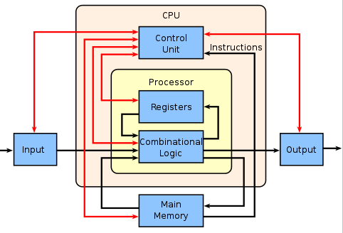
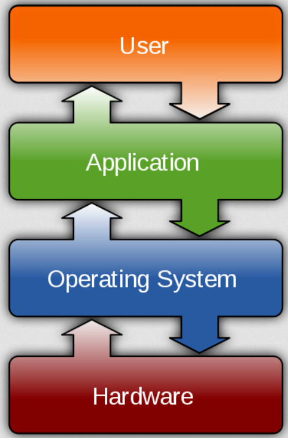
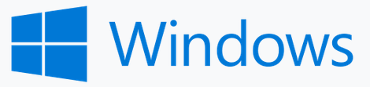
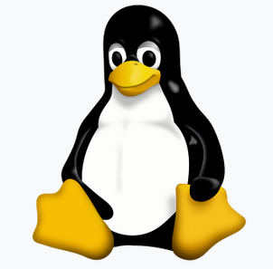
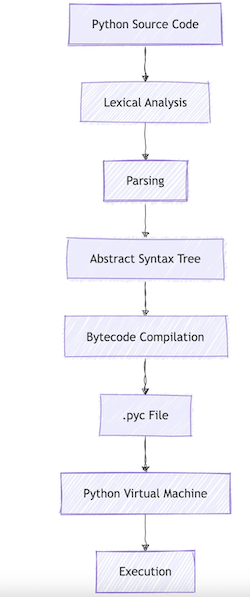

# Programowanie w języku Python

---

# Kim jestem

* Tomasz Domżalski
* tomdom@gumed.edu.pl
* Wesoły doktorant ! 
* pomoże jak może
* Tuwima 15, pokój 312

---

# O kursie

* Kurs dla początkujących
* Nie trzeba nic wiedzieć o programowaniu
* Ale trzeba cokolwiek wiedzieć o komputerkach
   
---

# Co na przykład?

* Co to jest plik?
* Czym jest folder/ścieżka do folderu?
* Podstawowe operacje na plikach i folderach.
* Czym jest rozszerzenie pliku _extension_?
* Czym jest plik tekstowy? Jak go otworzyć? Zobaczcie [here](https://www.youtube.com/watch?v=H7R0LN41N8c)

---

# Organizacja

* 14 spotkań po 90 minut (?Odrabianie?)
* Można ominąć **4 spotkania**, odrobić trzeba je we własnym zakresie
* Zapraszam do używania kamerek
* Mniej więcej co tydzień będzie _zadanie_ do zrobienia, ze sztywnym terminem na jego realizację, będzie to tydzień
* minus 1 pkt za każdy dzień opóźnienia
* Zaliczenie fakultetu będzie wymagało uzbierania 60% wszystkich możliwych punktów z wszystkich zadań
* Zadania będą do załadowania na kursie w moodlu

---

# EJAJ

* możecie używać LLMuf do rozwiązania zadań
* tylko, że można łatwo ograniczyć swój proces uczenia się
* stary dobry Gugiel? StackOverflow i masa innych.
* programowanie z Agentami jest super, tylko **jeśli się wie co się robi**

---

# Jak działa kompjuter?

---

# Komputer == kalkulator

---

# Wejście - Wyjście Flow

---

# Co na wejściu

* Klawiatura (tekst)
* Myszka (_pointer_ współrzędne)
* Touchpad (współrzędne zmapowane na współrzędne zgodne z logiką obsługującą myszkę)
* Ekran dotykowy
* To mogą być dane z nośnika danych lub z dysku twardego
* Dane z chmurek
* Audio
* Itp

---

# Pamięć

* RAM - Random Access Memory

---

# Procesor (CPU)

* Bardzo szybki, wielowątkowy kalkulator
* Jak szybki?
* Około 50-150 miliardów obliczeń na sekundę

---

# Output

* Monitor
* Głośnik
* Print z drukarki
* Itp

---

# Bits and bytes

* Bit to podstawowa jednostka **informacji**
* Can be 0 or 1
* Formalizm? Zapraszam na wiki [Claude Shannon](https://en.wikipedia.org/wiki/Claude_Shannon)
* 8 bitów składa się na **byte** 
* <https://en.wikipedia.org/wiki/Bit>

---

# ASCII

* Podstawowy format kodowania tekstu
* 7 bitów pozwala na kodowanie 128 znaków
* `011 1001` - cyfra 9
* `100 0001` - litera A
* `010 0000` - spacja

---

# UTF-8

* Współcześnie
* 1 112 064 znaków
* 8, a 32 bity
* Emoji, polskie znaki, cyrylica, you name it

---

# Bytes

* 8 bitów to 1 bajt
* **KILO**bajt to 1,000 bitów
* **MEGA**bajt to 1,000,000 bitów
* **GIGA**bajt to 1,000,000,000 bitów
* **TERA**bajt to 1,000,000,000,000 bitów

---

# Pisanie programów

* Skąd CPU wie co zrobić na z inputem?
* Potrzebny jest przepis, który zostaje zapodany z pomocą **programu**
* CPU zrozumie instrukcje tylko zapisane jako **kod maszynowy**

---

# Kod maszynowy

    8B542408 83FA0077 06B80000 0000C383
    FA027706 B8010000 00C353BB 01000000
    B9010000 008D0419 83FA0376 078BD989
    C14AEBF1 5BC3

---

# Assembly language

    fib:
    mov edx, [esp+8]
    cmp edx, 0
    ja @f
    mov eax, 0
    ret

    @@:
    cmp edx, 2
    ja @f
    mov eax, 1
    ret

    @@:
    push ebx
    mov ebx, 1
    mov ecx, 1

    @@:
        lea eax, [ebx+ecx]
        cmp edx, 3
        jbe @f
        mov ebx, ecx
        mov ecx, eax
        dec edx
    jmp @b

    @@:
    pop ebx
    ret

---

# C

    unsigned int fib(unsigned int n) {
    if (n <= 0)
        return 0;
    else if (n <= 2)
        return 1;
    else {
        unsigned int a,b,c;
        a = 1;
        b = 1;
        while (1) {
            c = a + b;
            if (n <= 3) return c;
            a = b;
            b = c;
            n--;
        }
      }
    }

---

# Języki programowania na wysokim poziomie abstrakcji

* **Python**
* Java
* Ruby
* Pearl
* R
* i wiele innych

---

# System operacyjny (OS)

* *To taki program do odpalania programów*
* Komunikuje się z hardwearem
* Umożliwia nam korzystanie z:
    * Grafiki
    * I/O - wymiana danych między urządzeniem, a otoczeniem
    * sieci komputerowych
    * z plików, które trzymamy w pamięci urządzenia
* Programy są zwykle napisane/kompilowane dla konkretnych systemów operacyjnych

---

# System operacyjny

---

---

# OS - Windows

---

# OS - MacOS

---

# OS - Linux

---

# Python

Python jest interpretowanym językiem wysokiego poziomu.

---

# Co to Python?

* Interpretowany - programy w Pythonie są skryptami, które nie muszą być kompilowane.
* Interpretowany - trzeba mieć dostęp do interpretera, aby móc odpalić kod.
* Interpretowany - oznacza to, że Python konwertowany na kod maszynowy poprzez interpreter.
* High-level - nie trzeba martwić się alokacją pamięci, dostępem do danych, komunikacją z hardwearem.

---

---

# Do czego on służy?

* Do wszystkiego
* Data science
* Scientific computing
* Machine learning / AI
* Web apps

---

# Guido van Rossum (1991)

---

# Wersje Pythona

* Aktualna wersja Pythona to 3.14
* Python 2 zakończył żywot w 2020 
* Python 3 nie jest kompatybilny wstecz

---

# Skrypty i kodowanie interaktywne

* Typowy sosób pracy z Pythonem to pisanie skryptów, plików tekstowych zawierających kod -> interpreter
* My będziemy używać czegoś co nazywa się programowaniem interaktywnym
* Co to znaczy? Piszesz kod, a rezultat widzisz od razu
* Do tego będziemy używać środowiska _Jupyter Notebooks_ 

---

# Z Jupytera można korzystać

* Lokalnie
* Online

---

# Lokalnie

* Anaconda Distribution <https://www.anaconda.com/distribution/>
* To zainstaluje Pythona wraz z użytecznymi paczkami (data science/scientific computing)
* Wykorzystuje interface o nazwie Jupyter Lab do pracy z notebookami
* Więcej znajdziecie tutaj: <https://jupyter.org>

---

# Online / remote

* Google Colaboratory (Colab)
* <https://colab.research.google.com>
* Potrzebne konto na google
* Python jest open-source

---

# Help / references / tutorials

- <https://docs.python.org/3/>
- <https://jupyterlab.readthedocs.io/en/stable/>
- <https://python.swaroopch.com>
- <https://colab.research.google.com/notebooks/>
- <https://www.codecademy.com/learn/learn-python-3>
- <https://www.udemy.com/learn-python-programming-and-cryptocurrency-data-analysis/?src=sac&kw=python>
- <https://www.datacamp.com>
- <https://youtube.com/>

---

# Środowisko do korzystania z Pythona w chmurze

<https://www.pythonanywhere.com>
